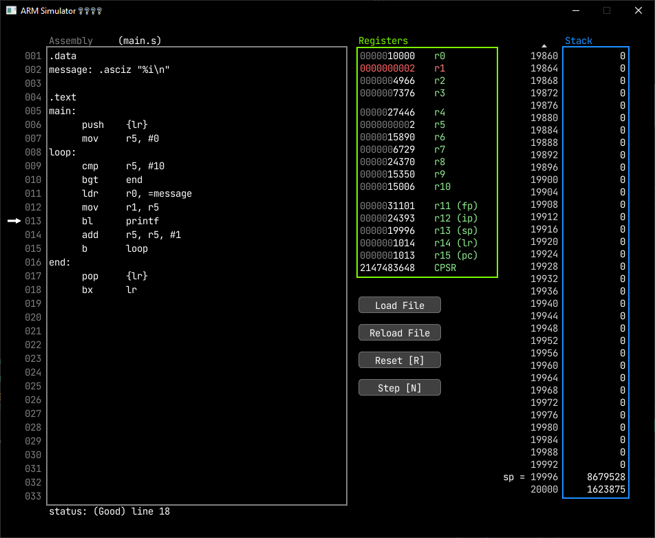

# ARM Simulator

A program that does it's best to simulate an ARM CPU.

This program does not handle all ARM instructions and is very **very** limited, but I mostly made this as a learning tool while taking an Assembly course, so eh.. who cares 🤷‍♂️.

# Building
DIRECTX CODE, SO ONLY WORKS ON WINDOWS (sadly)

0. Prerequisite: have [premake](https://premake.github.io/) installed
1. Run `premake5 vs2022` to generate the solution file
2. Compile with Visual Studio